# Cursors

My cursor theme repository.

## Available Packages

- `deepin-dark-xcursor` - Deepin Dark Xcursor theme
- `deepin-dark-hyprcursor` - Deepin Dark Hyprland cursor theme
- `deepin-light-xcursor` - Deepin Light Xcursor theme
- `deepin-light-hyprcursor` - Deepin Light Hyprland cursor theme
- `ssb-xcursor` - Super Smash Bros Ultimate Xcursor theme
- `earendil-dark-xcursor` - Earendil dark Xcursor theme generated from SVG
- `earendil-light-xcursor` - Earendil light Xcursor theme generated from SVG
- `earendil-dark-hyprcursor` - Earendil dark Hyprland cursor theme generated from SVG
- `earendil-light-hyprcursor` - Earendil light Hyprland cursor theme generated from SVG

## Credited Cursor Themes

- `deepin-dark` - Deepin dark SVG source plus generated Xcursor and Hyprland cursor package sources
- `deepin-light` - Deepin light SVG source plus generated Xcursor and Hyprland cursor package sources
- `earendil-dark` - Earendil dark SVG source plus generated Xcursor and Hyprland cursor package sources
- `earendil-light` - Earendil light SVG source plus generated Xcursor and Hyprland cursor package sources

<!-- previews:start -->
## Previews

Generated with `scripts/generate-readme-previews.py`.

| Deepin-Dark-xcursor | Deepin-Light-xcursor |
| --- | --- |
|  |  |

| Earendil-Dark-xcursor | Earendil-Light-xcursor |
| --- | --- |
| 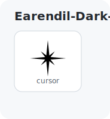 | 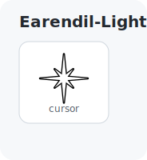 |

| Popucom-Black-xcursor | Popucom-Blue-xcursor |
| --- | --- |
| 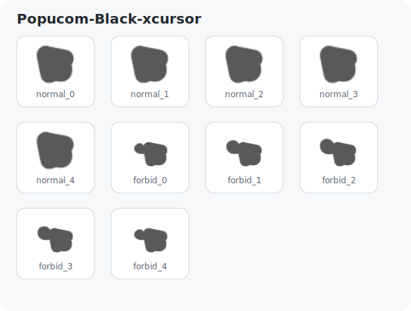 | 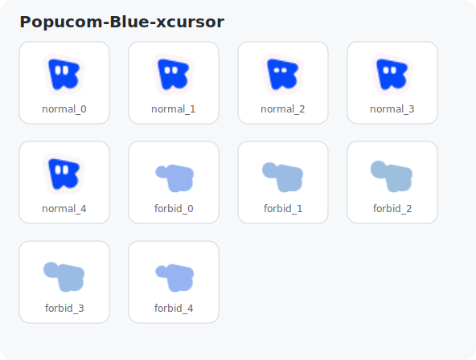 |

| Popucom-Cyan-xcursor | Popucom-Green-xcursor |
| --- | --- |
| 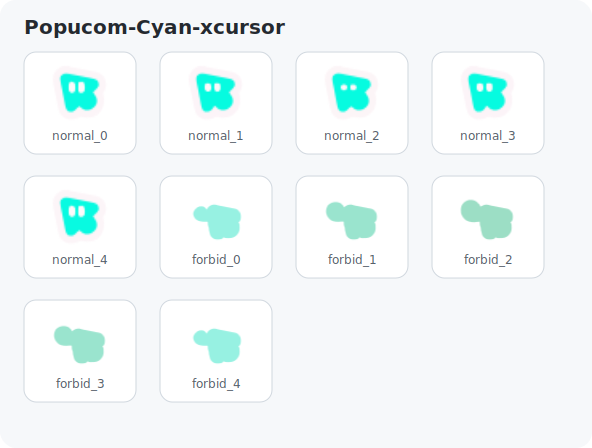 | 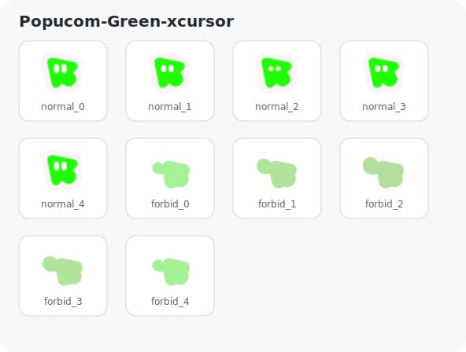 |

| Popucom-Grey-xcursor | Popucom-Inverted-xcursor |
| --- | --- |
| 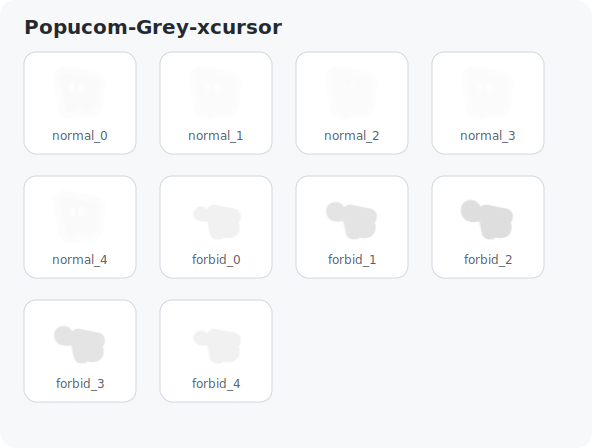 | 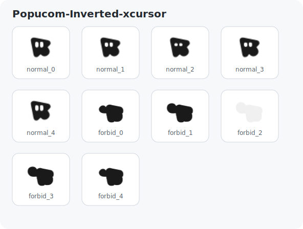 |

| Popucom-Orange-xcursor | Popucom-Pink-xcursor |
| --- | --- |
| 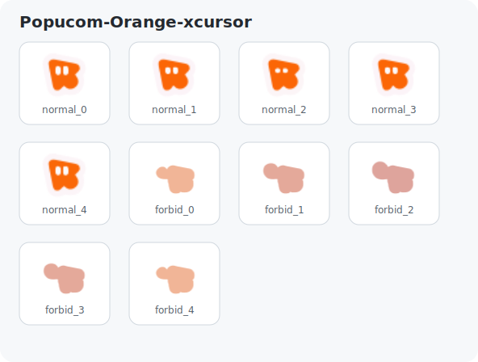 | 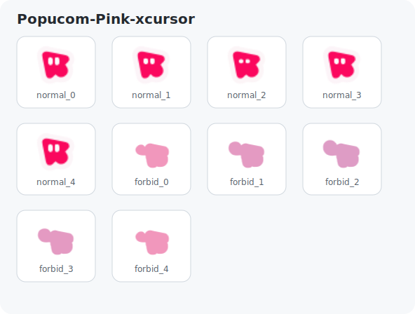 |

| Popucom-Purple-xcursor | Popucom-Red-xcursor |
| --- | --- |
| 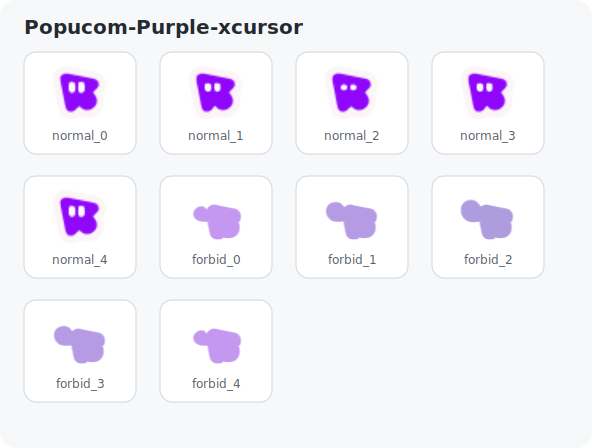 | 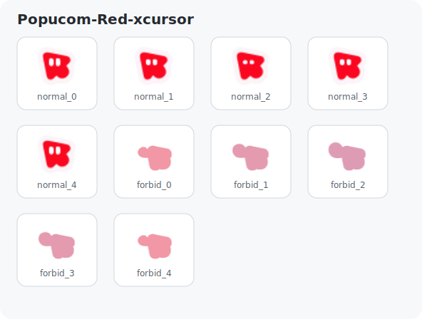 |

| Popucom-Yellow-xcursor | Raccoin-xcursor |
| --- | --- |
| 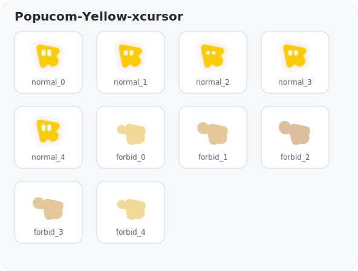 | 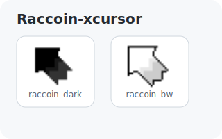 |

| SSB-xcursor | |
| --- | --- |
| 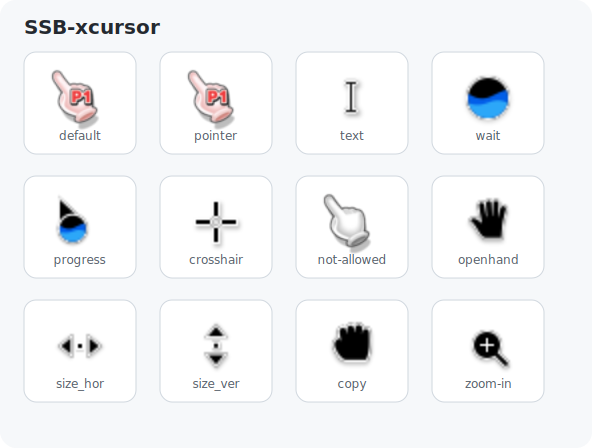 | |
<!-- previews:end -->
