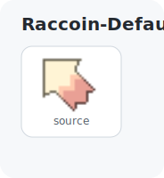
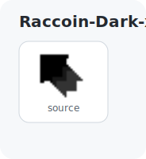
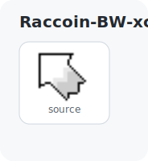
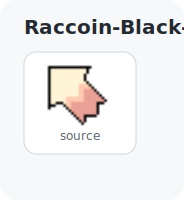

# Cursors

My cursor theme repository.

## Available Packages

### Combined theme packages

These package attrs install the matching Xcursor and Hyprcursor outputs where available, and expose reusable cursor metadata through `passthru`/lifted derivation attrs:

- `deepin-dark`, `deepin-light`
- `earendil-dark`, `earendil-light`
- `popucom-<colour>`
- `raccoin`, `raccoin-<variant>`
- `ssb` - Xcursor only

Example:

```nix
let
  theme = inputs.cursors.packages.${pkgs.system}.popucom-cyan;
in {
  environment.systemPackages = [ theme ];
  environment.sessionVariables = theme.mkCursorSessionVariables {
    xcursorSize = 24;
    hyprcursorSize = 24;
  };
}
```

Useful attrs include `theme.xcursorThemeName`, `theme.hyprcursorThemeName`, `theme.cursorTheme`, `theme.cursorSessionVariables`, `theme.gtkCursorSettings`, and the `mk*` helpers for size-aware settings.

### Deepin

- `deepin-dark-xcursor` - Deepin Dark Xcursor theme
- `deepin-dark-hyprcursor` - Deepin Dark Hyprland cursor theme
- `deepin-light-xcursor` - Deepin Light Xcursor theme
- `deepin-light-hyprcursor` - Deepin Light Hyprland cursor theme

### Earendil

- `earendil-dark-xcursor` - Earendil Dark Xcursor theme generated from SVG
- `earendil-dark-hyprcursor` - Earendil Dark Hyprland cursor theme generated from SVG
- `earendil-light-xcursor` - Earendil Light Xcursor theme generated from SVG
- `earendil-light-hyprcursor` - Earendil Light Hyprland cursor theme generated from SVG

### Popucom

Available colours: `pink`, `green`, `blue`, `yellow`, `red`, `orange`, `cyan`, `purple`, `grey`, `black`, `inverted`.

- `popucom-<colour>-xcursor` - Popucom animated Xcursor theme
- `popucom-<colour>-hyprcursor` - Popucom animated Hyprland cursor theme

### Raccoin

Available variants: `default`, `dark`, `bw`, `black-outline`.

- `raccoin-<variant>-xcursor` - Raccoin Xcursor theme
- `raccoin-<variant>-hyprcursor` - Raccoin Hyprland cursor theme
- `raccoin-xcursor` - alias for `raccoin-default-xcursor`
- `raccoin-hyprcursor` - alias for `raccoin-default-hyprcursor`

### SSB

- `ssb-xcursor` - Super Smash Bros Ultimate Xcursor theme

## Credited Cursor Themes

- `deepin-dark` - Deepin dark SVG source plus generated Xcursor and Hyprland cursor package sources
- `deepin-light` - Deepin light SVG source plus generated Xcursor and Hyprland cursor package sources
- `earendil-dark` - Earendil dark SVG source plus generated Xcursor and Hyprland cursor package sources
- `earendil-light` - Earendil light SVG source plus generated Xcursor and Hyprland cursor package sources
- `popucom` - Popucom colour variants plus generated Xcursor and Hyprland cursor package sources
- `themes/raccoin` - Raccoin colour variants plus generated Xcursor and Hyprland cursor package sources
- `ssb` - Super Smash Bros Ultimate Xcursor package source

<!-- previews:start -->
## Previews

Generated with `scripts/generate-readme-previews.py`.

| Deepin-Dark-xcursor | Deepin-Light-xcursor |
| --- | --- |
|  |  |

| Earendil-Dark-xcursor | Earendil-Light-xcursor |
| --- | --- |
|  |  |

| Popucom-Black-xcursor | Popucom-Blue-xcursor |
| --- | --- |
|  |  |

| Popucom-Cyan-xcursor | Popucom-Green-xcursor |
| --- | --- |
|  |  |

| Popucom-Grey-xcursor | Popucom-Inverted-xcursor |
| --- | --- |
|  |  |

| Popucom-Orange-xcursor | Popucom-Pink-xcursor |
| --- | --- |
|  |  |

| Popucom-Purple-xcursor | Popucom-Red-xcursor |
| --- | --- |
|  |  |

| Popucom-Yellow-xcursor | Raccoin-Default-xcursor |
| --- | --- |
|  |  |

| Raccoin-Dark-xcursor | Raccoin-BW-xcursor |
| --- | --- |
|  |  |

| Raccoin-Black-Outline-xcursor | SSB-xcursor |
| --- | --- |
|  |  |
<!-- previews:end -->
